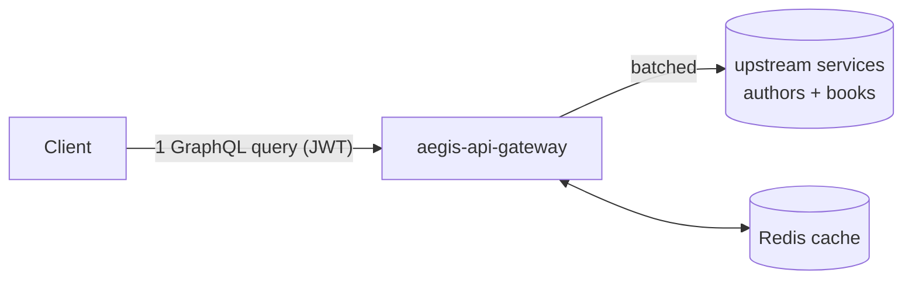

# aegis-api-gateway

A GraphQL + REST API gateway that federates multiple upstream services behind a
single authenticated edge. One GraphQL query fans out to several upstreams in one
client round-trip, and a **DataLoader collapses the classic N+1 into one batched
upstream call**.

**Stack:** Python 3.13 · FastAPI · Strawberry GraphQL · OAuth2/JWT · Redis · httpx ·
`uv` · Docker Compose · Ruff + mypy + pytest.

## Architecture



Two upstream domains — **authors** and **books** — are stitched into one schema:

```graphql
{ authors { name books { title } } }
```

Naively that is 1 call for authors + N calls for books (the N+1 problem). A
per-request DataLoader batches every book lookup into a single
`/books?author_ids=...` upstream call.

### Layout (hexagonal — the dependency arrow points inward)

```
src/aegis/
├── config.py              # pydantic-settings (12-factor, AEGIS_ prefix)
├── logging.py             # structlog JSON logs
├── main.py                # composition root: wires adapters together
└── adapters/              # the outside world
    ├── auth.py            # OAuth2/JWT verify + dev token issuer + scopes
    ├── upstream.py        # httpx client + Redis cache + circuit-breaker stub
    └── graphql.py         # Strawberry schema + the DataLoader (N+1 fix)
upstreams/mock_service.py  # throwaway upstream so the gateway has something to federate
```

`config`/`logging`/`adapters` have no knowledge of each other's wiring; `main.py`
is the only place that composes them. Business shape is unit-testable with zero I/O.

## Key decisions

- **GraphQL at the edge, REST internally** — clients get flexible single-round-trip
  queries; upstreams stay simple and independently deployable. See
  [ADR 0001](docs/adr/0001-graphql-edge-rest-internal.md).
- **DataLoader to kill N+1** — book lookups for all authors in a request coalesce
  into one upstream call. Proven by `tests/unit/test_dataloader.py`.
- **OAuth2/JWT with scopes** — bearer-token verification is decoupled from token
  issuance. A dev issuer ships here; swap in a real OAuth2 provider in production
  and verification is unchanged.
- **Redis cache + circuit-breaker stub** at the upstream-client boundary, so caching
  and resilience are infrastructure concerns the domain never sees.

## Run it (the demo)

Requires Docker. Brings up Redis, the mock upstream, and the gateway:

```bash
make up
```

```bash
# mint a dev token
TOKEN=$(curl -s localhost:8000/auth/token | python -c "import sys,json;print(json.load(sys.stdin)['access_token'])")

# one GraphQL query → authors with nested books → ONE upstream /books call
curl -s localhost:8000/graphql \
  -H "Authorization: Bearer $TOKEN" \
  -H 'content-type: application/json' \
  -d '{"query":"{ authors { name books { title } } }"}'

# REST fallback, auto-documented via OpenAPI/Swagger
open http://localhost:8000/docs
```

PowerShell equivalent for the token:

```powershell
$TOKEN = (Invoke-RestMethod -Method Post http://localhost:8000/auth/token).access_token
```

### Endpoints

| Method | Path            | Auth                  | Purpose                          |
|--------|-----------------|-----------------------|----------------------------------|
| POST   | `/auth/token`   | none (dev only)       | Mint a dev JWT with `read:authors` |
| POST   | `/graphql`      | Bearer JWT            | GraphQL edge + GraphiQL UI       |
| GET    | `/authors`      | `read:authors` scope  | REST fallback (in OpenAPI/Swagger) |
| GET    | `/healthz`      | none                  | Liveness probe                   |

## Develop

```bash
uv sync --all-extras --dev
uv run pre-commit install

make test        # pytest
make lint        # ruff check + format --check
make typecheck   # mypy src
make fmt         # ruff format + --fix
```

Config is 12-factor via env vars (prefix `AEGIS_`); see [.env.example](.env.example).

## What's intentionally a stub

This is a one-day, well-architected reference build, not a production deployment.
The dev token issuer, the in-process circuit-breaker counter, and the single mock
upstream are stand-ins whose *interfaces* are production-shaped — the point is that
swapping in a real OAuth2 provider, a shared breaker, or real upstreams touches only
the adapter, never the core.
